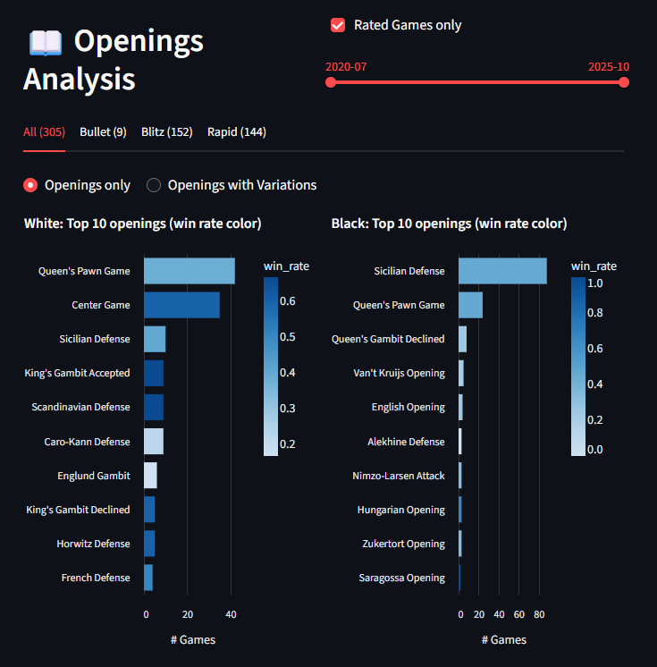
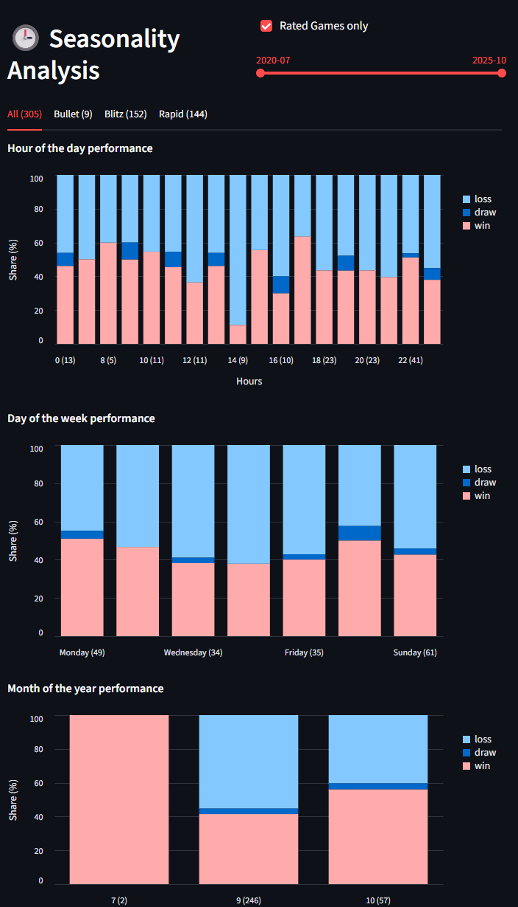

# ♟️ Chess Lense

Analyze your chess games with an interactive Streamlit dashboard.
Get insights into your **openings**, **win rates**, **rating trends**, and more — directly from your public chess.com data.

## 🚀 Live Demo
👉 [Open in Streamlit Cloud](https://chess-lense.streamlit.app)


## 🌍 Project Status

This is a non-commercial open-source hobby project.
If you find it useful, please ⭐ star the repo or share it with other chess enthusiasts!

## ✨ Features

### 📥 Load Games: Load your full game history directly from chess.com

### 📊 Dashboard: Explore your general performance and patterns

### 📖 Openings: Overview of your best- and worst-performing openings

### 🕒 Seasonalities: Shows you when you perform the best and the worst



## 🧭 How it works

1. Enter your **chess.com username**.  
2. The app fetches your public game data via the official [Chess.com API](https://www.chess.com/news/view/published-data-api).  
3. Your data is analyzed locally in the browser (no private storage).  
4. You can explore your performance and compare results interactively.

## ⚙️ Run locally

```bash
# 1. Clone repository
git clone https://github.com/infomadevisual/chess-com-streamlit
cd chess-com-streamlit

# 2. Create virtual environment and Install dependencies
pipenv install

# 3. Activate venv
pipenv shell

# 4. Run Streamlit app
streamlit run Home.py
```

## 🔒 Privacy

- The app only uses public chess.com data.
- No user data is shared or stored permanently.
- Cached data is kept temporarily for performance.

# ℹ️ Data Handling Notice
This project uses the Chess.com Published-Data API. Chess.com content is © Chess.com and used under their Published-Data API Terms. This project is unaffiliated with Chess.com.
This app temporarily stores downloaded game data from the Chess.com Published-Data API for performance and caching purposes only.
Cached data is not shared, sold, or redistributed.
All cached data remains local to the app instance and can be cleared at any time.
When hosted on any platform (e.g., Streamlit Community Cloud), temporary data may persist in session or cache storage managed by Streamlit’s infrastructure but is not used outside this context.
The project complies with the Chess.com Published-Data API terms and does not retain user data beyond what is necessary for performance optimization.
